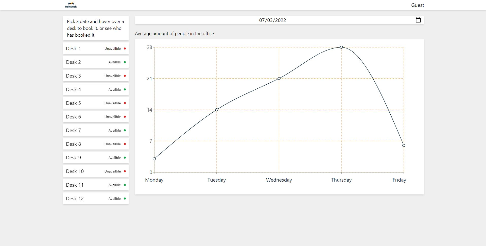
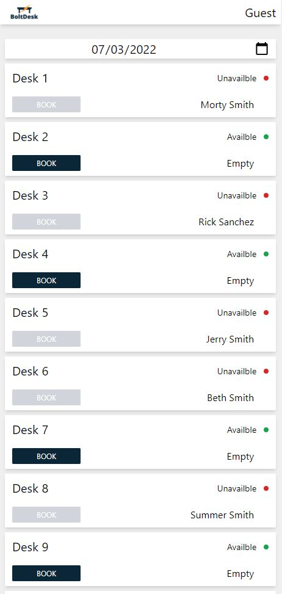

# Bolt Desk

> Boltdesk is my take on desk booking web application for hybrid workplaces. There is quite a lot going on in this seemingly simple application, such as caching and refetching data with react query, authentication flow and more...

> Live demo [_here_](https://frontend-boltdesk-cra.vercel.app/).
>
> Backend code [_here_](https://github.com/NemesOliver/bolt-desk-backend).

## Table of Contents

- [Technologies Used](#technologies-used)
- [Screenshots](#screenshots)
- [Project Status](#project-status)

## Technologies Used

- axios: "^0.26.1"
- react: "^17.0.2"
- react-cookie: "^4.1.1"
- react-query: "^3.34.16"
- recharts: "^2.1.9"
- typescript: "^4.6.2"

## Screenshots

## Project Status

Project is: _complete_
